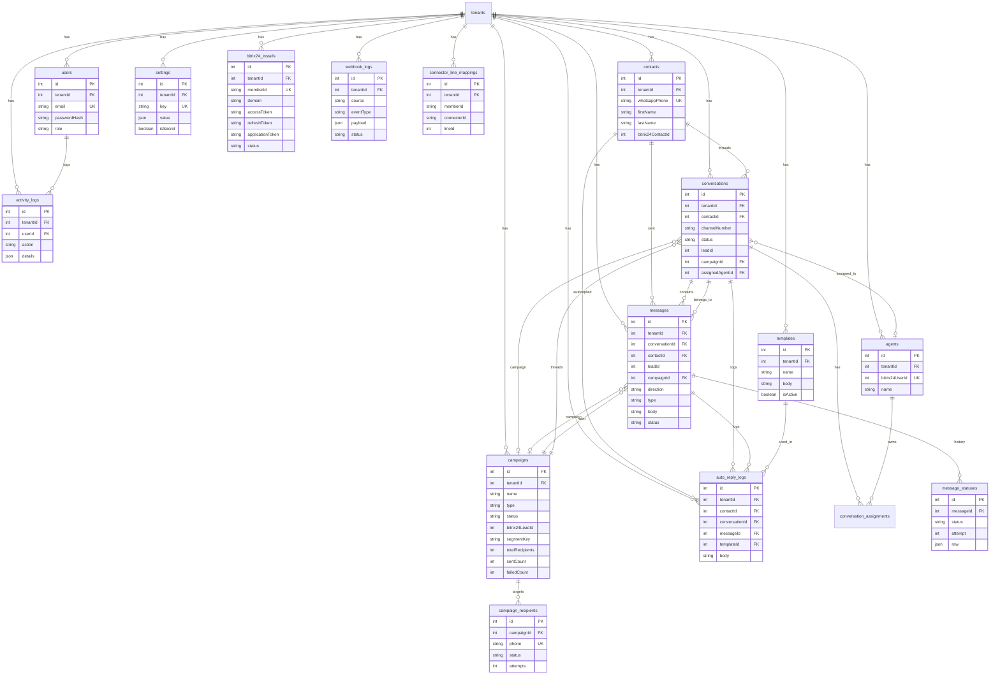

# Database ERD

WhatsBox <-> Bitrix24 multi-tenant integration (PostgreSQL). Generated from `prisma/schema.prisma`.

## Entity Relationship Diagram

```
tenants (Tenant)
 ├── users                 1:N  (users.tenantId → tenants.id)
 ├── activity_logs         1:N  (activity_logs.tenantId → tenants.id)
 ├── contacts              1:N  (contacts.tenantId → tenants.id)
 ├── conversations         1:N  (conversations.tenantId → tenants.id)
 ├── messages              1:N  (messages.tenantId → tenants.id)
 ├── campaigns             1:N  (campaigns.tenantId → tenants.id)
 ├── agents                1:N  (agents.tenantId → tenants.id)
 ├── settings              1:N  (settings.tenantId → tenants.id)
 ├── templates             1:N  (templates.tenantId → tenants.id)
 ├── bitrix24_installs     1:N  (installs.tenantId → tenants.id)
 ├── webhook_logs          1:N  (webhook_logs.tenantId → tenants.id)
 ├── auto_reply_logs       1:N  (auto_reply_logs.tenantId → tenants.id)
 └── connector_line_mappings 1:N (connector_line_mappings.tenantId → tenants.id)

users (User)
 ├── activity_logs 1:N     (activity_logs.userId → users.id, SetNull)

contacts (Contact) — UNIQUE (tenantId, whatsappPhone)
 ├── conversations 1:N     (conversations.contactId → contacts.id, Restrict)
 ├── messages      1:N     (messages.contactId → contacts.id, Restrict)
 └── auto_reply_logs 1:N   (auto_reply_logs.contactId → contacts.id)

conversations (Conversation) — UNIQUE (contactId, channelNumber)
 ├── messages            1:N (messages.conversationId → conversations.id, Cascade)
 ├── conversation_assignments 1:N (assignments.conversationId → conversations.id, Cascade)
 ├── auto_reply_logs     1:N
 ├── assignedAgent       N:1 (conversations.assignedAgentId → agents.id, SetNull)
 └── campaign            N:1 (conversations.campaignId → campaigns.id, SetNull)

messages (Message)
 ├── message_statuses   1:N (message_statuses.messageId → messages.id, Cascade)
 ├── auto_reply_logs    1:N (auto_reply_logs.messageId → messages.id)
 ├── conversation       N:1 (Cascade)
 └── campaign            N:1 (messages.campaignId → campaigns.id, SetNull)

campaigns (Campaign) — has bitrix24LeadId, segmentKey
 ├── messages       1:N
 ├── conversations  1:N
 └── campaign_recipients 1:N (campaign_recipients.campaignId → campaigns.id, Cascade)

campaign_recipients (CampaignRecipient) — UNIQUE (campaignId, phone)

agents (Agent) — UNIQUE (tenantId, bitrix24UserId)
 ├── conversations (assignedAgent) 1:N
 └── conversation_assignments 1:N (assignments.agentId → agents.id, Restrict)

settings (Setting) — UNIQUE (tenantId, key)

bitrix24_installs (Install) — UNIQUE memberId, UNIQUE (tenantId, memberId)

webhook_logs (WebhookLog)

message_statuses (MessageStatus)

conversation_assignments (ConversationAssignment)

templates (Template)
 └── auto_reply_logs 1:N (templateId → templates.id, SetNull)

auto_reply_logs (AutoReplyLog) — links Contact + Conversation + Message + Template

connector_line_mappings (ConnectorLineMapping)
```

## Mermaid



## Notes

- `users`, `agents`, `settings`, `templates`, `installs`, `webhook_logs`, `activity_logs` cascade-delete with their tenant.
- `contacts` and `conversations` use `Restrict` on delete so threads are never orphaned; `messages` cascade with their conversation.
- `campaigns.bitrix24LeadId` links a mirrored campaign back to the Bitrix24 lead that created it (two-way sync).
